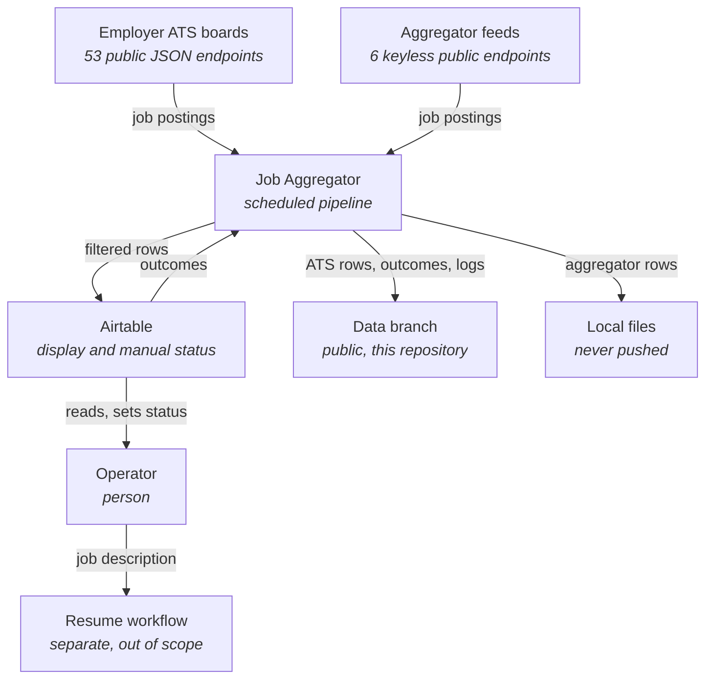
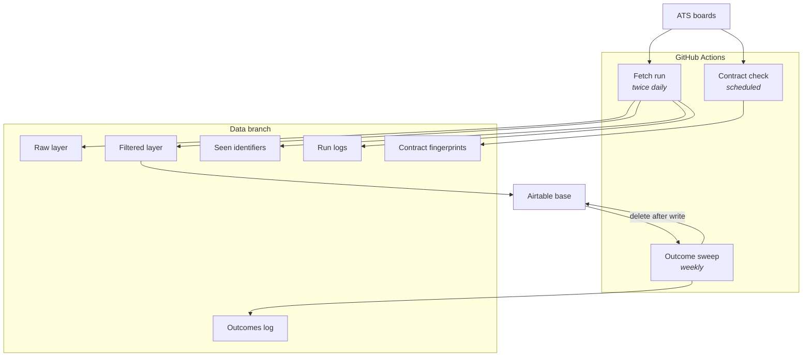
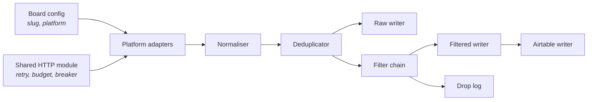

# Job Aggregator: Architecture

Version 2.0 | 2026-09-10 | Waqas Sharif

Supersedes `architecture.md`.

**Status: design, not built.** This document describes a system that does not yet exist. Every section states intent. Nothing here has been verified against running code, and no claim in it should be read as a description of behaviour until the slice in section 4 is live.

Structure follows arc42. All twelve sections are present. A section with nothing in it says why and what would go there.

Diagrams follow C4 levels, drawn in Mermaid flowchart syntax for renderer compatibility.

---

## 1. Introduction and Goals

### What this is for

Job discovery consumes the majority of a working week. The work is going to one employer's careers site after another, signing up where a site demands it, running two or three search terms by hand, and reading what comes back. The pipeline merges that into one table.

Two problems, stated separately because they are measured separately.

**Overhead.** Visiting many sites, onboarding at some of them, and searching each one by hand.

**Freshness.** Postings are encountered at a median of three to six days old, ranging from 24 hours to three weeks. By then the first review window has usually passed.

Tailoring an application is not a problem here and is out of scope. A separate process does it quickly.

### Quality goals, in order

| # | Goal | How it is judged |
|---|------|------------------|
| 1 | Freshness at discovery | Measure A, section 10. Binding. |
| 2 | Nothing is silently lost | Every posting either appears or carries a recorded drop reason |
| 3 | Search overhead falls | Measure B, section 10. Reported, not binding. |
| 4 | Runs unattended | Absences of one to ten days cost latency, never data |

### Stakeholders

One. The operator is the only user, the only reviewer, and the only decision maker. There is no second audience, and any design that assumes one is wrong.

---

## 2. Constraints

### Scope floor

These are not negotiable and are not time compromises. Each stands on its own reasoning, recorded in the decision it belongs to.

| Constraint | Recorded in |
|---|---|
| No scoring, ranking, or model-based classification of any posting | ADR-0010 |
| No user interface, dashboard, or web app | ADR-0010 |
| No notification beyond a table the operator opens | ADR-0014 |
| No paid data-acquisition runs | ADR-0019, section 11 |
| No email or search-alert ingestion | ADR-0012 |

### Cost

Free by default. Paid only where free is impossible, at the minimum that does the job, discussed before commitment.

### Verified third-party limits

Checked September 2026. Re-verify anything older than six months.

| Service | Limit | Binds |
|---|---|---|
| Airtable free | 1,000 records per base | Yes, mitigated by ADR-0014 |
| Airtable free | 1,000 API calls per month per workspace | No, projected usage ~130 |
| Airtable free | 5 requests per second | No |
| GitHub Actions | Free minutes on public repositories | No |
| GitHub Actions | Scheduled runs queued best-effort, may be delayed or dropped | Yes, absorbed by ADR-0007 |

### Source list

Two classes.

**Employer ATS boards.** The 53 with resolvable handles recorded in the operator's registry. One endpoint returns one employer.

**Aggregator feeds.** Six keyless, dated endpoints identified by research pass 0003: Jobicy, Himalayas, Arbeitnow, RemoteOK, We Work Remotely, ai-jobs.net. One endpoint returns many employers. ADR-0019.

Coverage is defined by those two lists and extended only by adding to them. Employer is always read from the response payload, never derived from a configuration entry, which is what lets one model serve both shapes.

---

## 3. Context and Scope

**Inside the boundary:** fetching, normalising, deduplicating, filtering, writing, scheduling, and the outcome sweep.

**Outside, deliberately:** application tailoring, application submission, follow-up tracking, any employer reachable through neither source class, and any judgement about whether a role is worth applying to.

---

## 4. Solution Strategy

Five decisions shape everything else. Reasoning is in the records named, not here.

**Three layers.** Raw holds everything fetched. Filtered holds what passed. Airtable is a projection of filtered, never an authority. Losing Airtable costs a display tool, not data. ADR-0001, ADR-0013.

**Fetch everything, filter in code.** Board endpoints offer no useful server-side filtering, and filtering at the source makes filter defects unobservable. Every drop is logged with the rule that caused it. ADR-0005.

**Deterministic rules only.** Every admitted or dropped row is explainable by naming one rule. No weights, no scores, no model. ADR-0010.

**Recency is presentation, not ingestion.** Nothing is filtered on publication date at fetch time, so a missed run costs latency rather than data. ADR-0007.

**Ship a slice, then add adapters.** Greenhouse and Lever first, eleven boards, plus Himalayas on condition so both source shapes are proven at once. Adapters are additive and carry little design risk; the structure carries it all. ADR-0009, ADR-0019.

**Storage routes by source class.** ATS rows go to the public data branch. Aggregator rows stay local, because two feeds prohibit redistribution and a branch inherits its repository's visibility. ADR-0020.

---

## 5. Building Block View

### Level 1: containers

### Level 2: components of the fetch run

**Platform adapters.** One per platform, never per employer. Greenhouse is one adapter serving nine boards; Himalayas is one adapter serving every employer it indexes. Each carries only that platform's parsing. All fetch behaviour lives in the shared HTTP module. Copying retry logic into an adapter is the failure this split exists to prevent.

**Normaliser.** Maps a platform's response onto one row shape. Reads employer from the payload, never from the config. Records which field supplied the ordering date, so a first-seen fallback is never mistaken for a publication date. Records the source, because ADR-0020 routes storage by it.

**Deduplicator.** Employer plus title plus publication date. Not row identity: 20 to 30 percent of harvested rows are one job posted to several cities. Must also work across source classes, since Arbeitnow indexes Greenhouse and SmartRecruiters, so the same posting can arrive twice. That requires an employer alias map, since an aggregator's employer string will differ from the employer's own.

**Filter chain.** Ordered cheapest disqualifier first: expiry, location, stated experience, annotation vendors, then title classification. Each drop records its rule.

**Writers.** Raw and filtered append deltas only. The Airtable writer batches ten records per call and performs no reads.

**Title pool.** A versioned file with dated changes, so a historical filter run is reproducible. ADR-0016.

### Coverage by platform

53 boards with resolvable handles, counted from the registry.

| Tier | Platforms | Boards | Status |
|---|---|---|---|
| A | Greenhouse, Lever | 11 | Endpoints documented. The slice. |
| B | Ashby, Workable, SmartRecruiters | 6 | Reported JSON, unverified |
| C | JazzHR, Manatal | 19 | No verified JSON. Pakistani-dominant. |
| D | Freshteam, BambooHR, Zoho, Workday, Pinpoint, Breezy, Dover, iCIMS, EY | 17 | Hardest, thinnest payoff |

Eight further employers are named in the registry without a resolvable handle, seven Workable and one Greenhouse, and are unpollable until someone reads the slug off the board.

---

## 6. Runtime View

### A normal fetch run

1. Load board config and seen identifiers.
2. For each board, request the complete output through the shared HTTP module, counting every attempt against the run's request budget.
3. Normalise to the common row shape.
4. Deduplicate against seen identifiers.
5. Append new postings to raw. Record first-seen.
6. Apply the filter chain. Log every drop with its rule.
7. Append survivors to filtered.
8. Batch-write to Airtable, ten per call.
9. Write the run log: per board, fetched, dropped by rule, written. Including zeros.
10. Commit to the data branch.

### A run that fails partway

Records are individually complete, so a partial append is not corrupting. The run exits with a code meaning stopped deliberately and resumable, which is distinct from could not start. The run log records what was written. The next scheduled run observes everything still on the boards, including anything published during the gap, because nothing is filtered on publication date.

### The weekly sweep

Read rows whose status is set. Write them to the outcomes log. Only then delete them from Airtable. Write before delete, never the reverse. Rows without a status are untouched, which is what makes the sweep safe during an absence.

### The contract check

Fetch one response per platform. Fingerprint the fields each adapter consumes: presence, type, whether null. Compare against the stored fingerprint. Report any change by field name. First run per platform establishes a baseline and returns no verdict.

---

## 7. Deployment View

**Compute:** GitHub Actions on a public repository.

**Schedules:** fetch twice daily, early PKT morning and early PKT evening; sweep weekly; contract check scheduled separately.

**Branches:** `main` holds code and documentation. A dedicated orphan data branch holds ATS-sourced rows, filtered rows, seen identifiers, outcomes, fingerprints and run logs. It is never checked out into `main`'s working tree, which deliberately avoids the stash-and-restore sequence the LinkedIn pipeline in `fyp-career-guidance` needs because its data directory is ignored on one branch and tracked on another.

**Local, never pushed:** aggregator-sourced rows, one file per source under `fetch-all/`. `fetch-all/himalayas.json`, `fetch-all/jobicy.json`. Provenance is the filename, so no routing bug can misfile a row. ADR-0020.

**Secrets:** the repository token, and an Airtable personal access token stored as a GitHub secret. No other credentials exist in the system. ADR-0012 keeps it that way.

**Local:** the fetch runs unattended in Actions and depends on no laptop being on. Aggregator raw files are the exception: they exist only on the operator's machine.

---

## 8. Crosscutting Concepts

**Crosscutting patterns.** Full statements live in the operator's cross-project engineering standards, which are private. The substance is stated here.

**Request budget.** A counter passed down the call stack, incremented on every attempt including retries, set below the real ceiling so the run stops short of the wall rather than discovering it.

**Circuit breaker.** On consecutive failures, never cumulative, reset on any success.

**Exit codes.** 0 finished, 1 could not start, 2 stopped deliberately and resumable. The orchestrator treats 2 as non-fatal.

**Atomic writes.** Write to a temporary file, then rename. Write before delete when moving data between stores.

**Canonical serialisation.** One serialisation per file, agreed by every writer, so a run that changes nothing produces a diff containing nothing. Without this the history is unreadable.

**Error classification.** On structured status fields, never on substrings of a message.

**Alignment.** By key, never by position. Fall back to position only when counts agree exactly; refuse to store when both fail.

**Dead-lettering.** A failure is recorded in the data, not only in a log, and is not skipped on the next run. The value is visibility, not suppression.

**Tolerant Reader.** Read only the fields consumed. Ignore everything else, so additive changes on a board's side never break anything.

**Run logging.** Per board, every run, including zero. A board returning nothing for a week is a broken adapter, and without a zero logged it is indistinguishable from a quiet market.

---

## 9. Architectural Decisions

Index only. Reasoning lives in `docs/decisions/` and is never restated here.

**On conflict between documents, ADR-0022 sets the order of authority.** This document sits below the decision records and above the reference material.

| ID | Decision | Status |
|----|----------|--------|
| 0001 | Two-layer store, raw and filtered | Accepted |
| 0002 | Raw layer on a git data branch, not a hosted database | Accepted |
| 0003 | Append deltas, not snapshots | Accepted |
| 0004 | Airtable as the filtered display layer | Accepted, one clause reversed by 0014 |
| 0005 | Fetch complete board output, filter locally | Accepted |
| 0006 | Twice-daily fetch cadence | Accepted |
| 0007 | Recency is a view, not an ingest filter | Accepted |
| 0008 | Title matching by allowlist, blocklist, and unmatched flag | Superseded by 0021 |
| 0009 | Vertical slice first, adapters incremental | Accepted |
| 0010 | No relevance scoring, ranking, or model-based screening | Accepted |
| 0011 | Public repository, metadata only on the data branch | Accepted |
| 0012 | No email or search-alert ingestion path | Accepted |
| 0013 | Three layers, filtered set persisted independently | Accepted |
| 0014 | Weekly status sweep, four-status outcome taxonomy | Accepted |
| 0015 | Two measures, and the archive protocol | Accepted |
| 0016 | Title-only matching against a versioned title pool | Accepted, one clause reversed by 0021 |
| 0017 | Sanitised cassettes as adapter test fixtures | Accepted |
| 0018 | Scheduled contract check against live boards | Accepted |
| 0019 | Add aggregator feeds as a second source class | Accepted |
| 0020 | Route raw storage by source class | Accepted |
| 0021 | Allowlist-only title matching, with normalisation | Accepted |
| 0022 | Document authority order | Accepted |
| 0023 | Context artifact set and onboarding order | Accepted |
| 0024 | Session log format | Accepted |

---

## 10. Quality Requirements

### Measure A: freshness at discovery. Binding.

Publication date to first appearance in the display.

- Median at or under 24 hours.
- 90th percentile at or under 72 hours.
- Postings published before the pipeline's first successful run against their board are excluded as backfill.
- Coverage is reported alongside the measure, since some platforms expose no publication date.

The percentile does the work. Twice-daily polling makes a median above 12 hours structurally impossible, so a failing median means something is broken. The percentile catches a late-publishing board or an adapter that has silently stopped.

**Baseline:** three to six days, ranging 24 hours to three weeks, stated by the operator. Not measured, and not retrospectively measurable, because the existing Application Log records application dates rather than discovery dates. The gap between baseline and target is large enough that this imprecision does not affect the verdict. If the result comes out marginal, that is itself the finding.

**When it fails:** the schedule is disabled, a written assessment is produced naming which record's Assumptions turned out false, and one of three outcomes is chosen: archive, targeted change with a new falsifier and a fresh two-week window, or rebuild from this document. One reassessment only. A second failure archives. ADR-0015.

### Measure B: search overhead. Reported, not binding.

Hours per week spent on job discovery, including time reading the display. A poor result means the display needs a better view, not that the build was wrong.

### Correctness scenarios

| Scenario | Expected |
|---|---|
| A filter rule is deliberately broken | The drop count for that rule rises by a matching amount and the affected rows are enumerable from the raw layer |
| A scheduled run is skipped | The following run ingests everything published during the gap |
| A board slug is pointed at a dead endpoint | The run log shows zero for that board and the run completes |
| A row is deleted from Airtable by hand | It remains in the filtered layer with its first-seen timestamp intact |
| A stored fingerprint has a field removed by hand | The contract check names that field |
| Two runs occur with no new postings | The second commit contains no change but the run log |

Each of these is a check that can fail. A check nobody has seen fail is not a check.

---

## 11. Risks and Technical Debt

### Risks

**Publication-date coverage is unknown.** No endpoint has been tested. If most platforms expose no publication date, Measure A is computable on a small subset. Mitigated by reporting coverage rather than assuming it.

**Board-side propagation is assumed near zero.** Not measured for any platform. If wrong, the fetch cadence is wrong. Measure A would expose it.

**Scheduled runs may be silently dropped.** GitHub documents that scheduled workflows are queued best-effort and may be delayed or dropped under load, producing no error. Accepted rather than investigated: the manual cost of auditing run history is high, and ADR-0007 makes a dropped run cost latency rather than data.

**Scheduled workflows may be disabled after repository inactivity.** Whether commits from the Actions bot reset that clock is not established. The LinkedIn pipeline in `fyp-career-guidance` has run over 100 consecutive times on bot commits alone, which is evidence against the risk but not proof.

**The geocoder in harvested data was unreliable in both directions.** A Kentucky university placed in Islamabad, a Colombian role in Khyber Pakhtunkhwa, and "Karachi, Punjab, Pakistan" appearing repeatedly when Karachi is in Sindh. No derived location is treated as verified. Direct board polling gives raw location text instead, which is weaker but not fabricated.

**Airtable ownership.** One uncorroborated source reports an August 2026 acquisition agreement. If free-tier terms change, only the display is affected, because ADR-0013 keeps the authority elsewhere.

**Title-only matching misses roles.** A posting titled "Software Engineer" whose description describes agentic work is caught by a manual full-text search and missed here. The unmatched bucket and the `rejected_pipeline` outcome reasons are the only signals, so both must be reviewed rather than merely recorded.

**Aggregator rows have no offsite copy.** ADR-0020 keeps them local, so a machine failure loses them permanently. A board only returns what is currently open, so the history cannot be rebuilt. Accepted deliberately; the mitigation is the deferred private repository.

**Aggregator terms may change.** Jobicy and Remotive already restrict redistribution. Quotas and clauses recorded in research 0003 were accurate on 2026-09-10 only.

**Karachi on-site coverage is essentially absent.** None of the six aggregators carry it, and Rozee.pk, the dominant Pakistani board, exposes no API of any kind. Its robots.txt has not been read, so even the scraping option is unassessed.

### Debt taken deliberately

**No paid data acquisition.** Four Apify censuses cost $2.92 in total, of which $0.73 bought six technical rows out of sixty because one query used a bare seniority term. The pool was declared exhausted and no further paid run is commissioned without a change in the operator's profile. Free sources only, which is why research pass 0003 assessed every candidate on cost first.

**Tier D is excluded from the slice** and may stay excluded. Nine adapters for 17 boards, including the two hardest platforms.

**Eight registry employers are unpollable** until their board slugs are read off the site by hand.

**Description matching is deferred**, not rejected. Revisited once field coverage per platform is known. It would require revisiting ADR-0011.

**Cassettes go stale.** ADR-0018 covers detection, not repair.

---

## 12. Glossary

| Term | Meaning |
|---|---|
| **Adapter** | Code for one platform, never one employer. Greenhouse is one adapter serving nine boards |
| **Aggregator** | A source whose single endpoint returns postings from many employers |
| **ATS** | Applicant tracking system. The software an employer's careers page runs on |
| **Backfill** | Postings already open when the pipeline first polled their board. Excluded from Measure A |
| **Board** | One employer's job list on an ATS platform |
| **Cassette** | A recorded real response, sanitised and committed, replayed in tests |
| **Contract check** | Scheduled comparison of a board's live response shape against a stored fingerprint. Not a test |
| **Data branch** | Orphan branch holding all pipeline state. Never checked out into `main` |
| **Drop log** | Record of every posting removed by a filter, with the rule that removed it |
| **Falsifier** | A condition fixed in advance which, if met, means the thing failed |
| **Filtered layer** | Postings that passed every filter. Durable, on the data branch |
| **First-seen** | When the pipeline first observed a posting. Distinct from its publication date |
| **Raw layer** | Every posting fetched, unfiltered, permanent |
| **Slug** | The identifier an ATS uses for an employer in its URL |
| **Source class** | Employer ATS board or aggregator feed. Determines where raw rows are stored |
| **Slice** | The Greenhouse and Lever vertical, live end to end before other adapters exist |
| **Sweep** | Weekly job reading outcomes from Airtable, persisting them, then deleting the rows |
| **Unmatched** | A posting whose title matched neither the allowlist nor the blocklist. Shown, marked, separated |
